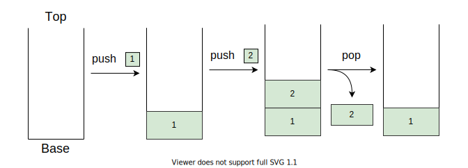
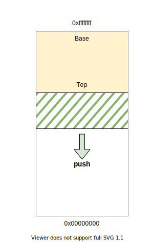
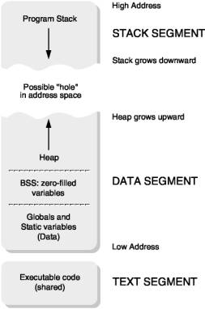

# Reading: Introduction to the Stack

In this lab, we will learn about how the stack is represented in assembly language, its utility, and how to it could be useful to us.

## Reminder: Stack Data Structure

> **NOTE:** This is a quick reminder on how the abstract data structure works.
> If you feel like you already understand this, you can skip this part.

In the world of algorithms and data structure, a "stack" is a data structure used to hold data, mirroring a real-life stack of objects (for example, a stack of books, or a stack of boxes).
This data structure's usefulness comes from optimizing the ease and speed at which elements can be added or removed from the top of the stack.
It forces us to think about how our data is organized relative to the stack's base and top.
The usual operations with the stack are:

- `push` - add an element to the top of the stack
- `pop` - get the element from the top of the stack **and remove it**
- `peek` or `top` - get the element from the top of the stack **without removing it**

The image below shows a stack data structure at different stages.
The empty stack gains the element labeled "1" after the instruction "push 1" is applied to it.
After the instruction "push 2", the stack has two items, element 1 being below element 2.
Finally, the "pop" instruction makes the stack lose element 2.



As the above image suggests, the order in which items are inserted and removed from a stack is represented by the phrase "first in, last out".

## So, Why is it Useful?

In the previous chapters we learned how to work with the basics of assembly.
The x86_64 architecture provides plenty general-purpose registers for us to use in our programs, but sometimes we need to store and reuse multiple values.
Using up all our registers for this purpose could prove to be a waste of resources.
Likewise, creating global variables for temporary values is not memory efficient and, at some point, we'll struggle to even name them something reasonable!

You might have also felt the absence of functions. The stack will help us out as it provides a nice place to store:

- the values of registers before entering a function so they can be restored on exit,
- and some metadata useful for when we want to exit out of a function.

More on this in the next lab.

As you might have guessed, the solution to this is to use a stack on which we can put arbitrary values onto.
We don't need implement it ourselves - it comes built-in 😄!
Whenever a program stars, the kernel makes sure a zone of memory is allocated for the sole purpose of writing arbitrary data onto.
Moreover, CPUs also have some specialized instructions that work directly with this memory in a way similar to how a normal stack works.

> **Note**: The size of the stack memory area is often [set at compile-time](https://stackoverflow.com/questions/54821412/how-to-increase-stack-size-when-compiling-a-c-program-using-mingw-compiler).
> When going over the maximum allocated space, you can receive a Segmentation Fault, and the phenomenon is called a `Stack Overflow`.
> You will have probably received this error when you declare a local array with a very high capacity, or when calling a recursive function which never returns.

## Stack Operations

The stack can be modified in two ways:

1. By using special instructions designed for stack operations, the most common of which are `push` and `pop`:

```assembly
%include "io.asm"

section .text
global CMAIN
CMAIN:

    mov rax, 7
    mov rbx, 8
    add rax, rbx
    push rax                  ; push the value of the rax register onto the stack
    mov rax, 10               ; we can now use the rax register, as its value is saved on the stack
    PRINTF64 `%d \n\x0`, rax  ; 10

    pop rax                   ; retrieve the value of the rax register from the stack
    PRINTF64 `%d \n\x0`, rax  ; 15
```

1. By directly accessing the memory with the help of a special register in which the top of the stack is held - `rsp` also known as the "stack pointer register".

```assembly
%include "io.asm"

section .text
global CMAIN
CMAIN:
    mov rax, 7
    mov rbx, 8
    add rax, rbx
    sub rsp, 8           ; reserve 8 bytes on the stack
    mov [rsp], rax       ; move the contents of the rax register to the new address pointed to by rsp
    mov rax, 10
    PRINTF64 `%d \n\x0`, rax

    mov rax, [rsp]       ; retrieve the value from the stack
    add rsp, 8           ; restore the value of the rsp register
    PRINTF64 `%d \n\x0`, rax
```

> **IMPORTANT:** Comment out the instructions `sub rsp, 4` and `add rsp, 4`.
> What happens?
> Why?
>
> **NOTE:** The stack is used to remember the return address when a function is called.
> **Note that the stack grows from higher addresses to lower addresses.**
> This is why memory allocation on the stack is done using the `sub` instruction, and deallocation is done using the `add` instruction.



Some processors do not have support for stack operations: for example, MIPS processors do not have `push` and `pop` instructions and do not have a special register for the stack pointer.
Thus, if we want to implement stack operations on a MIPS processor, we would do it exactly as in the example above, but we can choose any register to keep track of the stack pointer.

Therefore, the `push rax` instruction on an x86_64 processor is equivalent to:

```assembly
sub rsp, 8
mov [rsp], rax
```

And the `pop rax` is equivalent to:

```assembly
mov rax, [rsp]
add rsp, 8
```

> **IMPORTANT:** We need to be careful with the amount of data allocated on the stack because the size of the stack is limited.
> Overfilling the stack will lead to the well-known error of **stack overflow** (more in the security lab).
>
> **NOTE:** The default stack size on Linux for a 64-bit architecture is 8MiB.

## Stack in the Context of a Process's Address Space

A process's address space, or more precisely, a process's virtual address space, represents the virtual memory area usable by a process.
Each process has its own address space.
Even in situations where two processes share a memory region, the virtual space is distinct, but it maps to the same physical memory region.



In the figure above, a typical process's address space is presented.

The four important zones in a process's address space are the data zone, the code zone, the stack, and the heap.
As can be observed from the figure, the stack and the heap are the zones that can grow.
In fact, these two zones are dynamic and only make sense in the context of a process.
On the other hand, the information in the data and code zones is described in the executable.

## Tricks and Tips

1. The golden rule of stack usage is: the number of `push`-es should equal the number of `pop`-s in a function.
Given that the stack is used for function calls, it is very important that when a function finishes its execution, the stack pointer should be updated so that it points to the same memory location (of the stack) as it did at the time of entering the function.

1. In situations where we perform N `push`-es and reach the end of the function without doing a `pop` for any of the values, we can restore the stack pointer using the `add` instruction.

```assembly
section .text
global CMAIN
CMAIN:
    mov rax, 5
    mov rbx, 6
    mov rcx, 7

    push rax
    push rbx
    push rcx

    add rsp, 24     ; equivalent to using 3 consecutive pop-s
    ret
```

1. An alternative method is to save the current stack pointer value in a separate register, such as `rbp`, before performing any `push` operations.
This allows us to easily restore the stack pointer value at the end of the function, without having to keep track of the number of `push` operations performed.

```assembly
section .text
global CMAIN
CMAIN:

    mov rbp, rsp       ; save current stack pointer value in rbp

    mov rax, 5
    mov rbx, 6
    mov rcx, 7

    push rax
    push rbx
    push rcx

    mov rsp, rbp       ; restore stack pointer value
    ret
```

> **IMPORTANT:** What is the primary use of the `rbp` register?

As we can observe, the `rbp` register defines the stack frame for each function.
Similarly to how we can address local variables using the `rsp` register, we can do the same with `rbp`.
Additionally, we will see that, on 32-bit systems, function parameters are addressed using its 32-bit equivalent, `ebp`.
